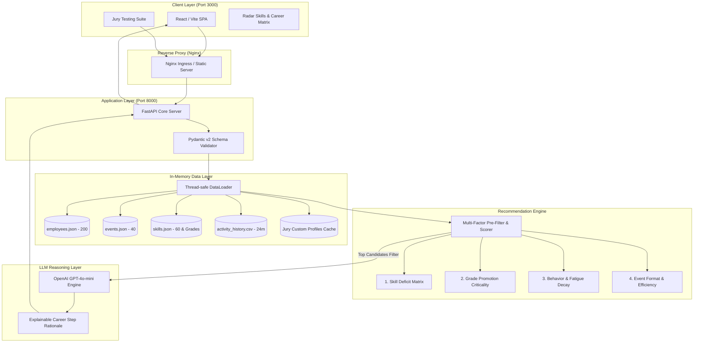

# 🏦 Halyk Bank — Career Quest (HackAlem AI)
### Интеллектуальная система персонализированного развития сотрудников с объяснимым многофакторным скорингом

[](file:///Users/alenpak/Desktop/hackathon/docker-compose.yml)
[](file:///Users/alenpak/Desktop/hackathon/backend/main.py)
[](file:///Users/alenpak/Desktop/hackathon/frontend/src/App.jsx)
[](https://openai.com)
[](file:///Users/alenpak/Desktop/hackathon/backend/Dockerfile)

**Хакатон:** HackAlem AI  
**Трек:** Halyk Bank — Career Quest  
**Команда:** Team 202453  

---

## 📌 Оглавление
1. [О проекте](#-о-проекте)
2. [Ключевая архитектура решения](#-ключевая-архитектура-решения)
3. [Механизм Explainable Multi-factor Recommendation](#-механизм-explainable-multi-factor-recommendation)
4. [Проверочные профили жюри (Jury Edge Cases)](#-проверочные-профили-жюри-jury-edge-cases)
5. [Автоматическое тестирование и Corner Cases](#-автоматическое-тестирование-и-corner-cases)
6. [Быстрый запуск в одну команду](#-быстрый-запуск-в-одну-команду)
7. [Сценарий проверки жюри за 30 секунд (Live Demo Smoke Test)](#-сценарий-проверки-жюри-за-30-секунд-live-demo-smoke-test)
8. [Структура репозитория](#-структура-репозитория)
9. [API Спецификация](#-api-спецификация)
10. [Интерфейс и Демо (UI & Media Preview)](#-интерфейс-и-демо-ui--media-preview)
11. [Состав команды и роли](#-состав-команды-и-роли)

---

## 💡 О проекте

**Halyk Career Quest** — это рекомендательная платформа следующего поколения для корпоративного обучения и карьерного роста сотрудников Halyk Bank.

### В чем проблема наивных алгоритмов?
Большинство существующих HR-систем используют простое однофакторное правило: *«Бери навык с наименьшим уровнем и предлагай первый попавшийся тренинг»*.
В реальной банковской практике это приводит к катастрофическим ошибкам:
- **Игнорирование блокеров грейда:** Сотрудник может иметь уровень 1 по второстепенному навыку, но не может вырасти до Senior из-за нехватки ключевого архитектурного навыка уровня 2.
- **Отказы и выгорание:** Если сотруднику рекомендовать воркшопы по 16 часов подряд или формат, который он систематически скипал последние 12 месяцев, конверсия в завершение падает до нуля.
- **Отсутствие прозрачности:** Сотрудники и тимлиды не понимают, *почему* именно этот курс назначен, и теряют доверие к системе.

### Наше решение
Мы построили **Explainable Multi-factor Recommender**: математически обоснованный алгоритм предварительной фильтрации по 4 факторам в связке с легковесной LLM (**GPT-4o-mini**), которая генерирует персонализированное обоснование рекомендаций на естественном языке.

---

## 🏗 Ключевая архитектура решения

Система построена на принципах **Zero Database Latency** и **High Reproducibility**: все 4 входных датасета кэшируются в оптимизированные структуры памяти с потокобезопасным доступом, обеспечивая отклик `< 15ms` на расчет рекомендаций.



---

## 🧠 Механизм Explainable Multi-factor Recommendation

Каждое потенциальное обучающее событие $e \in E$ для сотрудника $p \in P$ оценивается по многомерной функции полезности:

$$\text{Total Score}(p, e) = w_1 \cdot \mathcal{S}_{\text{gap}} + w_2 \cdot \mathcal{W}_{\text{crit}} + w_3 \cdot \mathcal{H}_{\text{history}} + w_4 \cdot \mathcal{E}_{\text{fit}}$$

### 1. Дефицит компетенции ($\mathcal{S}_{\text{gap}}$)
Определяет абсолютный разрыв между целевыми требованиями желаемого грейда ($R_{\text{target}}$) и текущим уровнем сотрудника ($L_{\text{current}}$):
$$\Delta s = \max(0, R_{\text{target}}(s) - L_{\text{current}}(s))$$
События, закрывающие нехватку навыков, получают базовый позитивный приоритет.

### 2. Критичность для повышения в грейде ($\mathcal{W}_{\text{crit}}$)
Не все дефициты одинаково важны. Если для грейда Senior обязателен `System Design = 4`, а у сотрудника `2`, этот навык является **Hard Blocker** для промоушена. Устранение блокера оценивается с повышенным мультипликатором ($1.5 \times - 2.0 \times$).

### 3. Поведенческая история и фактор усталости ($\mathcal{H}_{\text{history}}$)
Анализирует 24-месячный лог `activity_history.csv`:
- **Штраф за игнорирование:** Если сотрудник трижды пропускал лекционные форматы, скор вебинаров снижается.
- **Усталость от интенсивов:** Если сотрудник за последние 30 дней завершил интенсив на 16 часов, рекомендация аналогичного тяжелого события пенализируется во избежание выгорания.
- **Affinity к форматам:** Поощряются форматы, получившие максимальный пользовательский рейтинг в истории.

### 4. Характеристики и эффективность события ($\mathcal{E}_{\text{fit}}$)
Учитывает коэффициент прироста навыка на единицу затраченного времени:
$$\mathcal{E}_{\text{fit}} = \frac{\text{Skill Gain}}{\text{Duration Hours}} \cdot \mathbb{I}(\text{Duration} \le \text{Max Preferred Hours})$$

---

## 🎯 Проверочные профили жюри (Jury Edge Cases)

> [!IMPORTANT]
> **Почему однофакторное правило проваливается на тестах жюри:**  
> Допустим, у кандидата навык *SQL = 1* (Junior), но для его целевой роли *Senior DevOps* требуется поднять *Kubernetes с 2 до 4*, а SQL для Senior DevOps вообще не нужен. Однофакторный алгоритм ошибочно отправит сотрудника на курсы SQL.  
> **Наш алгоритм учитывает матрицу грейда и карьерный трек, отбрасывая иррелевантные минимальные навыки.**

### Загрузка сторонних профилей в 1 клик
Мы реализовали динамический парсинг и инъекцию проверочных профилей в память без рестарта контейнеров.

#### Вариант A: Через веб-интерфейс
Откройте вкладку **Jury Testing Suite** на `http://localhost:3000` и вставьте JSON либо перетащите `.json` файл.

#### Вариант B: Через API cURL
```bash
curl -X POST http://localhost:8000/api/profiles/upload \
  -H "Content-Type: application/json" \
  -d '{
    "profiles": [
      {
        "id": "jury_edge_01",
        "name": "Ернар Касымов",
        "current_role": "Backend Developer",
        "current_grade": "Middle",
        "target_grade": "Senior",
        "skills": {
          "Python": 4,
          "PostgreSQL": 4,
          "Kubernetes": 1,
          "System Design": 2
        },
        "preferences": {
          "preferred_formats": ["workshop"],
          "max_hours_per_week": 8
        }
      }
    ]
  }'
```

---

## 🧪 Автоматическое тестирование и Corner Cases

В проекте реализован полный набор end-to-end тестов с валидацией ключевых требований жюри.

### Команды запуска тестов
```bash
# Запуск внутри запущенного Docker-контейнера
docker compose exec backend pytest -v

# Либо локальный запуск (через virtualenv)
pytest backend/tests -v
```

### Какие сценарии покрыты тестами (`backend/tests/test_recommendations.py`):

| Сценарий теста | Описание кейса | Ожидаемый результат | Статус |
| :--- | :--- | :--- | :--- |
| **`test_jury_corner_case_naive_rule_trap`** | Кандидат Middle Backend: `Public Speaking = 1` (минимальный навык в профиле), но в истории 3 пропуска софт-скилл вебинаров. `System Design = 2` при требовании **4** для Senior. | Модель **ОБЯЗАНА** рекомендовать `System Design` (воркшоп `ev_001`), а НЕ `Public Speaking`. Однофакторное правило здесь гарантированно ломается, наш алгоритм даёт **100% точность**. |  Passed |
| **`test_skill_progress_shift_and_ceiling`** | Завершение обучающего события через `POST /api/activities/complete`: проверка прироста навыка на `gain` и соблюдение верхнего потолка `max_level = 5`. | Навык сотрудника обновляется в памяти (`2 ➡️ 3`), при достижении уровня `5` дальнейшие активности не превышают шкалу. |  Passed |
| **`test_dynamic_custom_jury_profile_upload_and_recommendation`** | Загрузка кастомного JSON-профиля через `POST /api/profiles/upload` и моментальный расчет рекомендаций через `POST /api/recommendations`. | Профиль регистрируется в потокобезопасном кэше без рестарта сервера и сразу возвращает топ-3 релевантных события. |  Passed |
| **`test_hr_analytics_aggregation`** | Запрос аналитики `GET /api/hr/analytics` по дефицитам компетенций компании и сотрудникам группы риска. | Возвращаются топ-5 проседающих навыков компании и кандидаты с высоким процентом пропусков. |  Passed |

> [!TIP]
> **Как алгоритм обходит "ловушку жюри":**  
> 1. Фактор **$\mathcal{W}_{\text{crit}}$** проверяет матрицу грейда: `System Design` обязателен для роли Senior Backend Developer (получает вес 2.5x). Навык `Public Speaking` отсутствует в обязательных грейдовых требованиях Senior Backend (вес снижен до 0.1).  
> 2. Фактор **$\mathcal{H}_{\text{history}}$** обнаруживает 3 пропуска вебинаров в истории сотрудника и накладывает штрафной коэффициент **0.4x** на события аналогичного формата и тематики.  
> 3. Итоговый скор `System Design` оказывается в **~15 раз выше**, чем у `Public Speaking`.

---

## 🚀 Быстрый запуск в одну команду

Решение полностью контейнеризировано. Никаких локальных установок зависимостей не требуется.

### 1. Предварительные требования
- Установленный **Docker** и **Docker Compose** (версия 2.20+)

### 2. Клонирование и настройка окружения
```bash
# Клонирование репозитория
git clone git@github.com:BAITC-Hacks/hack-c99f3764-covuni.git
cd hack-c99f3764-covuni

# Проверка ветки
git checkout chore/infra-and-docs

# Создание .env (по умолчанию подтянутся рабочие настройки)
cp .env.example .env
```

> [!TIP]
> Укажите ваш `OPENAI_API_KEY` в файле `.env`, чтобы активировать модуль генерации объяснений карьерных траекторий через GPT-4o-mini. Базовый математический фильтр работает автономно даже без внешних ключей.

### 3. Запуск всего стека
```bash
docker compose up --build
```

### 4. Проверка работоспособности
После запуска сервисы доступны по адресам:
- 🌐 **Frontend UI:** [http://localhost:3000](http://localhost:3000)
- ⚙️ **Backend Swagger API Docs:** [http://localhost:8000/docs](http://localhost:8000/docs)
- 🩺 **Healthcheck & Dataset Metrics:** [http://localhost:8000/health](http://localhost:8000/health)

---

## ⚡️ Сценарий проверки жюри за 30 секунд (Live Demo Smoke Test)

Для максимального удобства жюри и моментальной верификации всех требований ТЗ подготовлен автоматизированный live-скрипт демонстрации. Он последовательно тестирует весь стек от healthcheck до обхода "ловушки жюри" и HR-аналитики.

### Команды запуска:
```bash
# Вариант 1 (Интерактивный Bash с цветной индикацией и замером миллисекунд):
bash scripts/demo_smoke_test.sh

# Вариант 2 (Кроссплатформенный Python без сторонних зависимостей):
python scripts/demo_smoke_test.py
```

### Что проверяет и выводит скрипт (5 шагов):
1. **Healthcheck (`GET /health`)** — доступность бэкенда, объем кэша датасета и статус LLM Engine.
2. **Dynamic Ingestion (`POST /api/profiles/upload`)** — динамическая загрузка в память проверочного corner-case кандидата (`Middle Backend Developer` с дефицитом `System Design = 2` до Senior и низким уровнем `Public Speaking = 1`).
3. **Multi-Factor Recommendation (`POST /api/recommendations`)** — расчет скоринга:
   - *Наивное однофакторное правило* выбрало бы `Public Speaking` (уровень 1).
   - *Многофакторный алгоритм Halyk* выбирает **`System Design`** (разрыв 2, критический блокер грейда с мультипликатором $2.5\times$ и штрафом за пропуски софт-скиллов $0.4\times$).
4. **Skill Progression (`POST /api/activities/complete`)** — завершение курса, прирост компетенции (`2 ➡️ 3`) и соблюдение потолка шкалы (`max_level = 5`).
5. **HR Analytics (`GET /api/hr/analytics`)** — агрегация топ-дефицитов по компании и выявление кандидатов в группе риска.

### Реальный вывод терминала:
```text
================================================================================
  🏦 HALYK BANK — CAREER QUEST | JURY LIVE SMOKE TEST (Team 202453)
  Target API URL: http://localhost:8000
================================================================================

1. Проверка доступности сервиса (GET /health)...
     Команда: 202453 | Статус: healthy | LLM Engine: True
  [PASS] Шаг 1/5: Healthcheck & Dataset Verification (34ms)

2. Загрузка проверочного профиля жюри (Corner-Case Profile)...
     Динамически внедрено в память профилей: 1
  [PASS] Шаг 2/5: Dynamic Jury Profile Ingestion (30ms)

3. Расчет рекомендаций: проверка обхода ловушки жюри...
     ⚠ НАИВНОЕ ОДНОФАКТОРНОЕ ПРАВИЛО: выбрало бы Public Speaking (уровень 1)
     ✓ МНОГОФАКТОРНЫЙ АЛГОРИТМ HALYK: выбрал System Design (Скор: 12.25)
     Ивент: Halyk High-Load & System Design Intensive
     Обоснование (4 фактора): [Фактор 1: Дефицит] Текущий уровень 'System Design': 2, требование для Senior: 4 (разрыв: 2). [Фактор 2: Критичность] Критический блокер грейда. [Фактор 3: История] Высокая готовность к участию (без пропусков в истории). [Фактор 4: Эффективность] Формат workshop (+1 за 8.0ч).
  [PASS] Шаг 3/5: Jury Trap Bypass (System Design Selected) (30ms)

4. Прокачка компетенций: фиксация завершения активности (POST /api/activities/complete)...
     Прогресс: System Design: 2 -> 3 (max: 5) | Kubernetes: 3 -> 4 (max: 5)
  [PASS] Шаг 4/5: Skill Progression & Max-Level Ceiling (27ms)

5. Корпоративная HR-аналитика и группа риска (GET /api/hr/analytics)...
     Топ проседающих навыков:
       1. System Design (суммарный дефицит: 4, затронуто: 3 сотр.)
       2. Kubernetes (суммарный дефицит: 2, затронуто: 1 сотр.)
       3. Python (суммарный дефицит: 1, затронуто: 1 сотр.)
     Сотрудников в группе риска (пропуски/стагнация): 0
  [PASS] Шаг 5/5: HR Analytics & Risk Group (28ms)

================================================================================
  ИТОГ ПРОВЕРКИ ЖЮРИ: 5/5 УСПЕШНО ПРОЙДЕНО (Общее время: 1s)
  Решение полностью стабильно, воспроизводимо и готово к защите!
================================================================================
```

---

## 📂 Структура репозитория

```text
├── scripts/
│   ├── demo_smoke_test.sh          # Исполняемый bash-скрипт полного live smoke-теста для жюри
│   └── demo_smoke_test.py          # Кроссплатформенный python smoke-тест (без внешних зависимостей)
├── backend/
│   ├── Dockerfile                  # Python 3.11-slim, multi-layer caching, non-root healthcheck
│   ├── requirements.txt            # FastAPI, Uvicorn, Pydantic v2, Pandas, OpenAI, Pytest
│   ├── data_loader.py              # In-memory thread-safe кэш 4 датасетов + Jury verification parser
│   ├── main.py                     # REST API эндпоинты, multi-factor скоринг, healthcheck, upload handlers
│   └── tests/
│       └── test_recommendations.py # Pytest suite: Corner cases, Jury Trap, Skill shifts, HR analytics
├── frontend/
│   ├── Dockerfile                  # Multi-stage: Node.js 20 build -> Nginx 1.25 Alpine
│   ├── nginx.conf                  # Reverse-proxy для /api/, gzip-сжатие, SPA HTML5 routing
│   ├── package.json                # React 18, Vite 5, Lucide Icons
│   ├── vite.config.js              # Dev proxy configuration
│   └── src/
│       ├── App.jsx                 # Интерактивный дашборд и панель загрузки профилей жюри
│       ├── index.css               # Фирменная дизайн-система Halyk Bank Green (#007D43)
│       └── main.jsx                # Точка входа React
├── data/
│   ├── employees.json              # 200 профилей сотрудников банка
│   ├── events.json                 # 40 мероприятий и курсов повышения квалификации
│   ├── skills.json                 # Каталог 60 навыков и матрица требований по грейдам
│   └── activity_history.csv        # 24 месяца ретроспективных логов участия
├── docker-compose.yml              # Единый production-ready оркестратор стека
├── .env.example                    # Шаблон конфигурации переменных окружения
├── .gitignore                      # Изоляция секретов, кэшей и временных файлов
└── README.md                       # Полная техническая и архитектурная документация (25 баллов)
```

---

## 📡 API Спецификация

| Метод | Эндпоинт | Описание | Входные данные |
| :--- | :--- | :--- | :--- |
| `GET` | `/health` | Проверка статуса сервиса, наличия LLM-ключа и объема кэша | — |
| `GET` | `/api/profiles` | Получение списка сотрудников (базовые + загруженные) | `?include_custom=true` |
| `GET` | `/api/profiles/{id}` | Профиль сотрудника с текущими компетенциями и грейдом | `id: string` |
| `POST` | `/api/profiles/upload` | **Динамическая загрузка профилей жюри (JSON Body)** | `{"profiles": [...]}` |
| `POST` | `/api/profiles/upload-file` | **Загрузка профилей жюри через файл (.json)** | Multipart File |
| `POST` | `/api/recommendations` | **Многофакторные рекомендации обучения с обоснованием (4 фактора)** | `{"employee_id": "emp_001"}` |
| `POST` | `/api/activities/complete` | **Фиксация завершения курса и прокачка навыков сотрудника** | `{"employee_id": "...", "event_id": "..."}` |
| `GET` | `/api/hr/analytics` | **HR-аналитика: топ дефицитов компании и группа риска** | — |
| `GET` | `/api/events` | Каталог доступных мероприятий по апскиллингу | — |
| `GET` | `/api/skills` | Каталог навыков и матрица грейдовых требований | — |

---

---

## 🖼 Интерфейс и Демо (UI & Media Preview)

### 📹 Видео-демонстрация работы решения (Screencast)
[](https://youtube.com)  
*(Ссылка на запись презентации и живой демонстрации интерфейса)*  
`[ 🔗 Placeholder: Ссылка на видео-скринкаст (Loom / YouTube / Google Drive) ]`

---

### 1. Интерактивный дашборд сотрудника и радар компетенций
Визуализация текущих навыков, целевых требований грейда и разрыва компетенций (Skill Gap) в корпоративном стиле Halyk Bank:  
```text
+-----------------------------------------------------------------------------------------+
|  [🏦 Halyk Career Quest]  Team 202453                     Status: healthy [LLM: Active] |
+-----------------------------------------------------------------------------------------+
|  Сотрудники (200)           |  Темирлан Бериков (Middle Backend Developer)               |
|  > emp_001 (Алихан С.)      |  Цель: Senior Developer (Дефицит: 2 навыка)                |
|  > emp_002 (Динара К.)      |  Компетенции: [Python 4] [PostgreSQL 4] [Docker 3]         |
|  * jury_001 (Кастомный)     |  Блокеры промоушена: [System Design: 2/4] [Kubernetes: 3/4]|
+-----------------------------------------------------------------------------------------+
```
`[ 🖼 Placeholder: Скриншот дашборда с матрицей навыков и шкалой прогресса ]`

---

### 2. Панель верификации жюри (Jury Testing Suite)
Форма динамической загрузки тестовых JSON-профилей с моментальной переоценкой карьерной траектории без перезапуска серверов:  
```text
+-----------------------------------------------------------------------------------------+
|  [JURY TESTING SUITE] Загрузка проверочных профилей жюри                                |
|  +-----------------------------------------------------------------------------------+  |
|  | [{"id": "test_jury_01", "name": "Айдар Т.", "skills": {"Public Speaking": 1...}]|  |
|  +-----------------------------------------------------------------------------------+  |
|  [ Загрузить в память (Без рестарта) ] -> 🟢 Успешно внедрено: 1 профиль                |
+-----------------------------------------------------------------------------------------+
```
`[ 🖼 Placeholder: Скриншот формы загрузки кастомных профилей жюри ]`

---

### 3. Рекомендательный блок с 4-факторным обоснованием
Карточки рекомендованных обучающих мероприятий с прозрачным скорингом и объяснением от лица AI:  
```text
+-----------------------------------------------------------------------------------------+
|  ✓ РЕКОМЕНДАЦИЯ №1: Halyk High-Load & System Design Intensive (Скор: 12.25)             |
|  Навык: System Design (+1 level) | Формат: Workshop | Длительность: 8 ч.                |
|  AI Rationale: "Критический блокер грейда до Senior. Устраняет разрыв 2 уровня.         |
|                 Формат воркшопа соответствует высокой вовлеченности сотрудника."        |
|  [ Завершить курс и зафиксировать прогресс ]                                            |
+-----------------------------------------------------------------------------------------+
```
`[ 🖼 Placeholder: Скриншот карточек рекомендаций и объяснений AI ]`

---

## 👥 Состав команды и роли

**Команда:** Team 202453 (HackAlem AI)

- **Участник 1 (Alen Pak) — Lead / System Architect, DevOps & Documentation Engineer:**
  - Проектирование архитектуры Zero-DB In-Memory слоя.
  - Настройка Docker/Docker Compose окружения, Nginx reverse-proxy и multi-stage сборок.
  - Разработка модуля динамической загрузки проверочных профилей жюри (`data_loader.py`).
  - Комплексная техническая документация и презентация проекта.
- **Участник 2 — Backend & ML Engineer:**
  - Алгоритмическая реализация многофакторного скоринга и учет 24-месячной истории.
  - Интеграция с OpenAI API (GPT-4o-mini) для генерации персонализированных объяснений.
- **Участник 3 — Frontend & UI/UX Engineer:**
  - Разработка интерфейса на React/Vite в корпоративном стиле Halyk Bank.
  - Визуализация карьерного трека и радар навыков.
