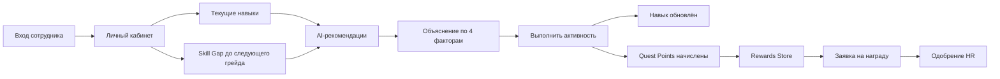
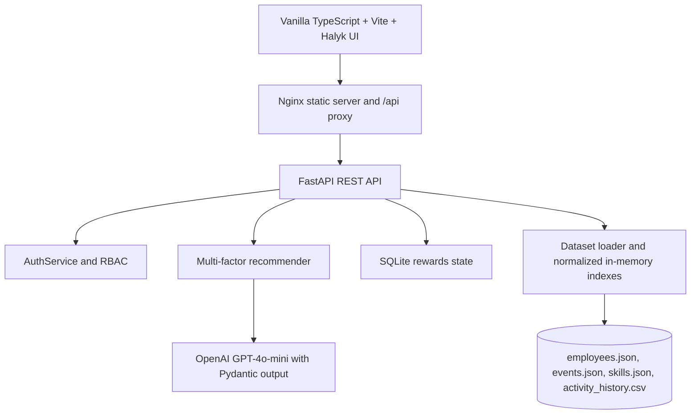

# Halyk Career Quest AI

### Внутренняя платформа персонального развития сотрудников Halyk Bank

HackAlem AI · Team 202453

Halyk Career Quest AI помогает сотруднику понять текущий уровень навыков, увидеть разрыв до следующего грейда и выбрать следующий практический шаг. Платформа также включает Quest Points и приватный магазин вознаграждений, а HR предоставляет агрегированную аналитику развития и использования наград.

> Важно: это внутренний хакатонный прототип. Учётные записи из этого README предназначены только для локальной демонстрации и не являются корпоративным SSO.

---

## Содержание

- [Возможности](#возможности)
- [Главный пользовательский сценарий](#главный-пользовательский-сценарий)
- [Приватность и правила геймификации](#приватность-и-правила-геймификации)
- [Архитектура](#архитектура)
- [Структура проекта](#структура-проекта)
- [Быстрый запуск через Docker](#быстрый-запуск-через-docker)
- [Локальный запуск без Docker](#локальный-запуск-без-docker)
- [Демо-доступ](#демо-доступ)
- [Работа с фронтендом](#работа-с-фронтендом)
- [API](#api)
- [Рекомендательный алгоритм](#рекомендательный-алгоритм)
- [Quest Points и Rewards Store](#quest-points-и-rewards-store)
- [Авторизация и роли](#авторизация-и-роли)
- [Тестирование и smoke test](#тестирование-и-smoke-test)
- [Переменные окружения](#переменные-окружения)
- [Troubleshooting](#troubleshooting)
- [Команда](#команда)

---

## Возможности

### Для сотрудника

- защищённый вход в личный кабинет;
- выбор профиля сотрудника из официального датасета;
- поддержка профиля `E0001` и других сотрудников из датасета;
- роль, грейд, стаж и целевой следующий грейд;
- сравнение текущих и требуемых уровней навыков;
- визуальный Skill Gap;
- 1–3 AI-рекомендации активностей;
- объяснение рекомендации по четырём факторам;
- отметка выполнения активности с пересчётом навыка;
- начисление Quest Points за добровольное развитие;
- приватный баланс и история баллов;
- магазин вознаграждений;
- заявка на награду с возможным одобрением HR;
- чат с Halyk AI Assistant;
- загрузка кастомного JSON-профиля жюри.

### Для HR

- агрегированная аналитика дефицитов навыков;
- сотрудники, которым может потребоваться поддержка;
- Rewards Insights;
- самые востребованные награды;
- доля категорий магазина;
- путь от заработанных баллов до погашения награды;
- количество заявок и ожидающих решений;
- HR approval queue;
- одобрение, отказ и выдача наград;
- отсутствие публичных рейтингов и публичных балансов сотрудников.

---

## Главный пользовательский сценарий



Система не предлагает просто «самый низкий навык». Она ищет следующий полезный шаг с учётом карьерной цели, требований грейда, истории участия, формата активности и уже выполненных мероприятий.

---

## Приватность и правила геймификации

Проект рассчитан на сотрудников крупной банковской организации, поэтому геймификация не должна превращаться в публичное соревнование.

### Что разрешено

Quest Points начисляются за добровольные действия:

- выполнение AI-рекомендованной активности, закрывающей Skill Gap;
- участие во внутренних митапах и хакатонах;
- проведение воркшопа;
- менторство и помощь коллеге;
- качественную обратную связь по курсу;
- инициативы по обмену знаниями;
- Monthly Momentum — добровольный развивающий шаг в течение месяца.

### За что баллы не начисляются

Баллы не начисляются за:

- таймшиты;
- отсутствие опозданий;
- закрытие обычных рабочих тикетов;
- переработки;
- обязательные курсы;
- формальное заполнение отчётности;
- действия, которые являются обычной должностной обязанностью.

### Ограничения

- публичных Leaderboards нет;
- баланс сотрудника виден только ему самому;
- HR видит агрегаты и заявки, а индивидуальные данные доступны только в рамках роли и разрешений;
- отказ по заявке возвращает зарезервированные QP ровно один раз;
- повторная отправка одного и того же запроса не должна повторно списывать баллы;
- заявки на материальные и дорогие вознаграждения могут требовать одобрения HR.

---

## Архитектура



### Компоненты

| Компонент | Назначение |
| --- | --- |
| `frontend/` | Vanilla TypeScript SPA на Vite, без React |
| `backend/main.py` | FastAPI маршруты и бизнес-логика |
| `backend/data_loader.py` | Загрузка и нормализация стартового датасета |
| `backend/auth.py` | Локальные сессии, cookie/Bearer и RBAC |
| `backend/rewards.py` | Кошелёк, каталог, заявки и Quest Points |
| `data/` | 200 профилей, активности, навыки и история участия |
| SQLite state | Сохраняет аккаунты, профили, кошельки и заявки |
| `docker-compose.yml` | Запускает frontend и backend одной командой |

---

## Структура проекта

```text
.
├── backend/
│   ├── main.py
│   ├── auth.py
│   ├── rewards.py
│   ├── data_loader.py
│   ├── manage_users.py
│   ├── requirements.txt
│   ├── Dockerfile
│   └── tests/
├── frontend/
│   ├── src/
│   │   ├── main.ts
│   │   ├── api.ts
│   │   ├── types.ts
│   │   └── styles.css
│   ├── index.html
│   ├── vite.config.js
│   ├── nginx.conf
│   ├── Dockerfile
│   └── package.json
├── data/
│   ├── employees.json
│   ├── events.json
│   ├── skills.json
│   └── activity_history.csv
├── scripts/
│   ├── demo_smoke_test.py
│   ├── demo_smoke_test.sh
│   └── benchmark_sla.py
├── docker-compose.yml
├── .env.example
└── README.md
```

---

## Быстрый запуск через Docker

### Требования

- Docker Desktop;
- Docker Compose v2;
- Git.

### Запуск

```bash
git clone <URL_ВАШЕГО_РЕПОЗИТОРИЯ>
cd hack-c99f3764-covuni
cp .env.example .env
docker compose up --build
```

После запуска:

- Frontend: [http://localhost:3000](http://localhost:3000)
- Swagger: [http://localhost:8000/docs](http://localhost:8000/docs)
- Healthcheck: [http://localhost:8000/health](http://localhost:8000/health)
- API health: [http://localhost:8000/api/health](http://localhost:8000/api/health)

Для фонового режима:

```bash
docker compose up --build -d
docker compose ps
docker compose logs -f backend
```

Остановка без удаления сохранённого состояния:

```bash
docker compose stop
```

Не выполняйте `docker compose down -v`, если нужно сохранить кошельки, заявки и аккаунты.

---

## Локальный запуск без Docker

### Backend

```bash
python3 -m venv .venv
source .venv/bin/activate
pip install -r backend/requirements.txt
uvicorn backend.main:app --host 0.0.0.0 --port 8000 --reload
```

### Frontend

В отдельном терминале:

```bash
corepack enable
corepack prepare pnpm@11.19.0 --activate
pnpm --dir frontend install --frozen-lockfile
pnpm --dir frontend run dev
```

Frontend будет доступен на [http://localhost:3000](http://localhost:3000), а Vite будет проксировать `/api` на `http://localhost:8000`.

---

## Демо-доступ

Для демонстрации включите в `.env`:

```dotenv
AUTH_ENABLED=true
DEMO_ACCOUNTS_ENABLED=true
```

При старте backend автоматически создаёт следующие аккаунты, если их ещё нет:

| Роль | Логин | Пароль | Профиль |
| --- | --- | --- | --- |
| Сотрудник | `demo.employee` | `CareerQuest-Employee-2026!` | `E0001` |
| HR | `hr.manager` | `CareerQuest-HR-2026!` | — |

Существующие аккаунты не перезаписываются. Для другой среды демо-значения можно заменить через переменные `DEMO_*`.

Эти данные предназначены только для демонстрации хакатонной версии. Перед реальным использованием их необходимо заменить, хранить секреты вне Git и подключить корпоративный SSO.

Если включена защищённая авторизация, статус можно проверить через:

```bash
curl http://localhost:8000/api/auth/me
```

---

## Работа с фронтендом

Frontend написан на TypeScript без React. Основной вход — `frontend/index.html`, который подключает `frontend/src/main.ts` через Vite.

```bash
pnpm --dir frontend run dev
pnpm --dir frontend run build
pnpm --dir frontend run preview
```

Production-сборка создаётся в `frontend/dist` или в каталоге, указанном Vite-конфигурацией.

Фронтенд поддерживает:

- employee и HR views;
- login/logout flow;
- API indicator;
- fallback demo mode при недоступном backend;
- загрузку JSON-профилей;
- completion flow;
- rewards redemption;
- AI Assistant;
- RU/KZ language switch;
- desktop и mobile layouts.

---

## API

### Health и авторизация

| Метод | Endpoint | Назначение |
| --- | --- | --- |
| `GET` | `/health` | Docker healthcheck и статус датасета |
| `GET` | `/api/health` | Статус API, команды и загруженных данных |
| `GET` | `/api/auth/me` | Текущий режим авторизации и пользователь |
| `POST` | `/api/auth/login` | Вход по логину и паролю |
| `POST` | `/api/auth/logout` | Завершение сессии |

### Сотрудники и рекомендации

| Метод | Endpoint | Назначение |
| --- | --- | --- |
| `GET` | `/api/employees` | Список сотрудников |
| `GET` | `/api/employees/{employee_id}/profile` | Профиль и Skill Gap |
| `GET` | `/api/profiles/{employee_id}` | Альтернативный маршрут профиля |
| `POST` | `/api/recommendations` | 1–3 многофакторные рекомендации |
| `POST` | `/api/activities/{event_id}/complete` | Завершить активность |
| `POST` | `/api/activities/complete` | Legacy-совместимый маршрут |
| `POST` | `/api/profiles/upload` | Загрузить JSON-профиль в память |
| `POST` | `/api/profiles/upload-file` | Загрузить файл JSON/multipart |
| `GET` | `/api/events` | Каталог активностей |
| `GET` | `/api/skills` | Каталог навыков и матрица грейдов |

### Rewards Store

| Метод | Endpoint | Назначение |
| --- | --- | --- |
| `GET` | `/api/rewards` | Каталог наград и остатки |
| `GET` | `/api/employees/{id}/points` | Баланс сотрудника |
| `GET` | `/api/employees/{id}/points/transactions` | История операций кошелька |
| `POST` | `/api/rewards/{reward_id}/redeem` | Создать заявку и списать QP |
| `GET` | `/api/employees/{id}/rewards/requests` | Личная история заявок |
| `GET` | `/api/hr/rewards/requests` | Заявки для HR |
| `POST` | `/api/hr/rewards/requests/{id}/decision` | Одобрить или отклонить заявку |
| `POST` | `/api/hr/rewards/requests/{id}/fulfill` | Выдать одобренную награду |
| `GET` | `/api/hr/rewards/analytics` | Rewards Insights для HR |

### AI Assistant

| Метод | Endpoint | Назначение |
| --- | --- | --- |
| `POST` | `/api/chat` | Ответ AI Assistant по профилю сотрудника |

Пример запроса:

```bash
curl -X POST http://localhost:8000/api/chat \
  -H "Content-Type: application/json" \
  -d '{"employee_id":"E0001","message":"Что мне сделать следующим шагом?"}'
```

---

## Рекомендательный алгоритм

Система использует жёсткие фильтры, математический скоринг и AI-объяснение.

### Четыре фактора

1. **Current skill** — текущий уровень сотрудника.
2. **Next-grade requirement** — требование следующего грейда.
3. **Skill gap** — разница между текущим и необходимым уровнем.
4. **Participation history** — completed, missed, declined, dropped и предпочтительный формат.

Упрощённая модель:

```text
gap = max(0, required_level - current_level)
score = skill_gap_score
      + critical_skill_bonus
      + format_fit_bonus
      + participation_fit
      - history_penalty
```

### Hard filters

Перед скорингом удаляются:

- обязательные курсы, которые не должны назначаться системой рекомендаций;
- уже выполненные активности;
- активности без подходящих пререквизитов;
- активности с нулевым приростом;
- события, где сотрудник уже достиг `max_level`;
- несовместимые форматы с устойчивой историей пропусков или отказов.

`EV_036` — повторяемый Public Speaking Club и является специальным исключением для повторных рекомендаций.

### Почему однофакторное правило не подходит

Если у сотрудника самый низкий уровень по Public Speaking, это не означает, что именно этот навык является главным препятствием для повышения. Для Backend Engineer критическим блокером может быть System Design. Поэтому алгоритм учитывает матрицу целевого грейда и critical skills, а не сортирует только по минимальному числу.

OpenAI GPT-4o-mini используется для естественного объяснения уже отобранных кандидатов. Модель не должна самостоятельно придумывать навыки, баллы или активности: ответ валидируется схемой и дополняется локальным fallback, если API недоступен.

---

## Quest Points и Rewards Store

Quest Points — внутренняя валюта развития. Начальный баланс нового сотрудника равен нулю.

### Пример начислений

| Действие | Начисление |
| --- | ---: |
| AI-рекомендованная активность с положительным приростом | 150 QP |
| Воркшоп или knowledge sharing | согласно правилам события |
| Менторство | согласно правилам программы |
| Monthly Momentum | согласно правилам программы |

Для одного события начисление за выполнение одноразовое. Повтор API-запроса с тем же `Idempotency-Key` безопасен и не создаёт новое начисление.

### Категории магазина

- **Halyk Brand** — худи, шоперы и брендированные аксессуары;
- **Professional Growth** — конференции, курсы, книги и подписки;
- **Work-Life Balance** — mentoring coffee, learning day-off и другие нематериальные бенефиты.

### Жизненный цикл заявки

```text
Available → Pending → Approved → Redeemed
                    ↘ Rejected → QP returned
```

Ограниченные награды резервируют остаток на время заявки. При отказе резерв освобождается, а QP возвращаются ровно один раз.

Для completion и redemption используется `Idempotency-Key` — UUID одной операции. При сетевом повторе нужно отправлять тот же ключ; новая намеренная операция получает новый UUID. Это защищает от двойного начисления QP и повторного списания баланса.

Rewards state хранится в SQLite. В Docker путь должен указывать на persistent volume, например `REWARDS_DB_PATH=/app/state/rewards.sqlite3`. Не удаляйте volume через `docker compose down -v`, если требуется сохранить аккаунты, балансы, заявки и историю.

---

## Авторизация и роли

По умолчанию проект может работать в демо-режиме с `AUTH_ENABLED=false`. Для защищённого сценария установите `AUTH_ENABLED=true`.

### Employee

Сотрудник может:

- видеть только свой профиль;
- видеть свой баланс и транзакции;
- получить собственные рекомендации;
- завершить активность;
- создать заявку на награду;
- видеть только собственную историю;
- использовать AI Assistant в рамках своего профиля.

### HR

HR может:

- видеть агрегированную аналитику;
- видеть и обрабатывать reward requests;
- одобрять, отклонять и выдавать награды;
- загружать проверочные профили;
- смотреть Rewards Insights.

Пароли в backend хранятся как salted PBKDF2 hashes. Сессия ограничена по времени, а после серии неудачных попыток вход временно блокируется.

Создание пользователя через backend:

```bash
docker compose exec backend python manage_users.py --username employee@example.test --role employee --employee-id E0001
docker compose exec backend python manage_users.py --username hr@example.test --role hr
```

Для production необходимо заменить демо-пароли и подключить корпоративный identity provider.

---

## Тестирование и smoke test

### Backend tests

```bash
python -m pytest backend/tests -q
```

Проверяются:

- валидация профилей;
- запрет обязательных и уже выполненных активностей;
- пререквизиты и `max_level`;
- многофакторная рекомендация для edge case жюри;
- изменение навыка после completion;
- одноразовое начисление QP;
- параллельные покупки и остатки;
- возврат баллов при отказе;
- права employee/HR;
- HR-аналитика и Rewards Insights.

### Live smoke test

После запуска backend:

```bash
python3 scripts/demo_smoke_test.py
```

или:

```bash
bash scripts/demo_smoke_test.sh
```

Smoke test проверяет:

1. healthcheck;
2. загрузку кастомного профиля;
3. обход наивного однофакторного правила;
4. завершение активности и Skill Progression;
5. HR analytics;
6. базовый reward flow.

### Frontend build

```bash
pnpm --dir frontend install --frozen-lockfile
pnpm --dir frontend run build
```

### SLA benchmark

```bash
python3 scripts/benchmark_sla.py http://localhost:8000 20
```

Целевые ограничения:

- ответ UI/API для обычных операций — до 2 секунд;
- AI-рекомендации — до 10 секунд;
- при отсутствии OpenAI API локальный fallback не блокирует основной сценарий.

---

## Переменные окружения

Скопируйте шаблон:

```bash
cp .env.example .env
```

Основные параметры:

| Переменная | Назначение |
| --- | --- |
| `OPENAI_API_KEY` | API-ключ OpenAI; не коммитить |
| `OPENAI_MODEL` | По умолчанию `gpt-4o-mini` |
| `AUTH_ENABLED` | `false` для демо, `true` для авторизации |
| `DEMO_ACCOUNTS_ENABLED` | Автоматически создать демо employee/HR аккаунты |
| `DEMO_EMPLOYEE_USERNAME` | Логин демо-сотрудника |
| `DEMO_EMPLOYEE_PASSWORD` | Пароль демо-сотрудника |
| `DEMO_EMPLOYEE_ID` | Профиль демо-сотрудника, по умолчанию `E0001` |
| `DEMO_HR_USERNAME` | Логин демо-HR |
| `DEMO_HR_PASSWORD` | Пароль демо-HR |
| `AUTH_COOKIE_SECURE` | `false` для локального HTTP, `true` для HTTPS |
| `CORS_ORIGINS` | Разрешённые адреса frontend |
| `REWARDS_DB_PATH` | Путь к SQLite state |
| `DATA_DIR` | Каталог стартового датасета |
| `ENVIRONMENT` | `development` или `production` |

Секреты и SQLite-файлы должны быть в `.gitignore` и не должны попадать в Pull Request.

---

## Troubleshooting

### Frontend не видит backend

Проверьте:

```bash
curl http://localhost:8000/api/health
docker compose ps
docker compose logs backend
```

Для локального frontend Vite проксирует `/api` на порт `8000`. Для Docker frontend использует Nginx proxy.

### Login возвращает ошибку

Проверьте `AUTH_ENABLED`, наличие аккаунта и cookie-сессию:

```bash
curl -i http://localhost:8000/api/auth/me
```

Если это демо без пароля, установите `AUTH_ENABLED=false` и пересоздайте backend.

### OpenAI недоступен

Основной recommender продолжает работать на локальном многофакторном скоринге. AI explanation переключается на безопасный fallback. Проверьте `OPENAI_API_KEY`, модель и сетевой доступ контейнера.

### Пропал баланс или заявки

Проверьте, что SQLite хранится в persistent volume. Не используйте `docker compose down -v`, если состояние нужно сохранить.

### Backend запускается несколькими workers

Для текущей архитектуры используйте один Uvicorn process. Несколько workers могут иметь раздельные in-memory индексы и привести к несогласованному состоянию.

---

## Команда

**Team 202453 · HackAlem AI**

- **Lead / DevOps / Documentation** — контейнеризация, запуск, структура проекта, dataset loader и README;
- **Backend & AI Engineer** — FastAPI, многофакторный recommender, GPT-4o-mini, rewards backend, авторизация и тесты;
- **Frontend & UI/UX Engineer** — Halyk Bank UI/UX, TypeScript/Vite frontend, employee dashboard, HR analytics, Rewards Store и AI Assistant.

---

## Статус проекта

Проект готов к локальной демонстрации и дальнейшему объединению веток:

- frontend и backend запускаются раздельно или через Docker Compose;
- официальный датасет загружается при старте;
- поддерживается загрузка кастомных jury-профилей;
- рекомендации объяснимы и учитывают несколько факторов;
- завершение активностей обновляет навыки;
- Quest Points и Rewards Store связаны с развитием;
- HR видит агрегированные навыки и использование наград;
- проект не использует публичные рейтинги сотрудников.
